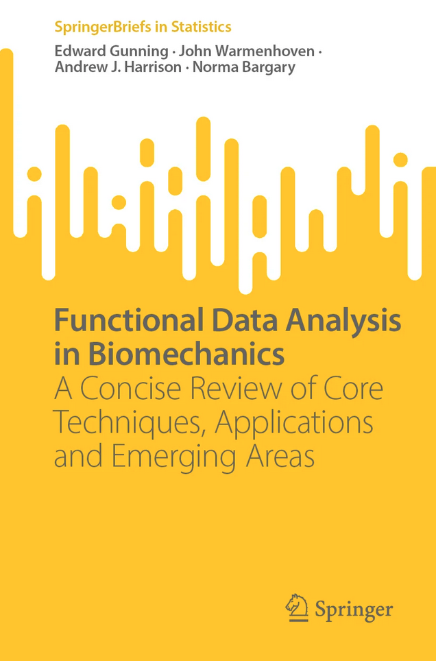

```{r setup, include=FALSE}
knitr::opts_chunk$set(echo = TRUE)
```

<center>

  

</center>

*__Note:__ that this course was originally designed for ISBS 2024 with [Prof. Drew Harrison (University of Limerick)](https://www.ul.ie/shprc/professor-drew-harrison). You can check out the original website [here](https://github.com/edwardgunning/ISBS-Short-Course/tree/main).*


```{r, echo=FALSE, include = FALSE}
htmltools::img(src = knitr::image_uri("logo/isbs-logo.png"), 
               alt = 'logo', 
               style = 'position:absolute; top:0; right:0; padding:10px;',
               width = "150px",
               heigth = "150px")
```

```{r, echo=FALSE, include = FALSE}
htmltools::img(src = knitr::image_uri("logo/fda-logo.png"), 
               alt = 'logo', 
               style = 'position:absolute; top:0; left:0; padding:10px;',
               width = "170px",
               heigth = "170px")
```

---

# Welcome

This is the web page for the workshop **"Functional Data Analysis in Sports Biomechanics"**, delivered by [Dr. Edward Gunning (University of Pennsylvania)](https://edwardgunning.github.io/) at the University of Technology Sydney (UTS) on the 21st of November 2024.

---

# 🖥 Computing Pre-requisites

## R and RStudio

You should bring your own laptop with the following software installed:

* **The R Language for Statistical Computing**
  * It can be downloaded from [https://cloud.r-project.org](https://cloud.r-project.org)
  * For further assistance see [this video by RStudio education](https://vimeo.com/203516510)

* **The RStudio Integrated Development Environment (IDE)**
  * It can be downloaded from [https://posit.co/](https://posit.co/)
  * For further assistance see [this video by RStudio education](https://vimeo.com/203516510) (**Note**: The RStudio company has changed to Posit PBC, so there may be some minor differences)


**Note**: If you are unable to install R and RStudio, you can work with a free, lite web version of RStudio called [*posit cloud*](https://posit.cloud/). Watch [this video from Posit PBC](https://www.youtube.com/watch?v=-fzwm4ZhVQQ) to set up an account and get started.

We also recommend setting up an RStudio project to work and store your files for this workshop in -- see [this helpful guide on setting up projects by Posit PBC](https://support.posit.co/hc/en-us/articles/200526207-Using-RStudio-Projects).

**IMPORTANT**: **We do not require any previous knowledge of R programming or FDA**. We have structured the lecture and practical sessions in such a way that all levels of experience will be catered for. However, if interested, our favourite (free!) resources for getting up to speed with R are:

* [R for Data Science (2nd Edition)](https://r4ds.hadley.nz/) by Hadley Wickham, Mine Çetinkaya-Rundel, and Garrett Grolemund.

* [R Programming for Data Science](https://bookdown.org/rdpeng/rprogdatascience/) by Roger D. Peng.

## R Packages

For this workshop, we will primarily use the `fda` (Ramsay, Graves and  Hooker, 2024) and `refund` (Goldsmith et al., 2024) packages.

To install these, you should run the following commands:

```{r, eval=FALSE}
install.packages("fda") # install the fda package
install.packages("refund") # install the refund package
```

---

# 📒 Material

* **Lecture Slides** (these MS Powerpoint slides will not preview in GitHub, so you will need to click the  icon on the top right to download):
    * [Welcome and introduction](slides/01-welcome.pptx)
    * [Part 1 -- Data representation and smoothing](slides/02-smoothing.pptx)
    * [Part 2 -- Registration](slides/03-registration.pptx)
    * [Part 3 -- Functional Principal Components Analysis (FPCA)](slides/04-fpca.pptx)
    * [Part 4 -- Functional regression](slides/05-fregression.pptx)

* **Practical Material**:
  * [Part 1 -- Data representation and smoothing](practicals/01-smoothing.md)
  * [Part 2 -- Registration](practicals/02-registration.md)
  * [Part 3 -- Functional Principal Components Analysis (FPCA)](practicals/03-fpca.md)
  * [Part 4 -- Functional regression](practicals/04-functional-regression.md)

* **Discussion/ Q&A**:
  * [List of potential discussion topics](slides/discussion-q-and-a.pptx)

---

# 🏢 Location

The workshop will take place at the UTS-Rugby Australia Building in Moore Park (room details TBC).

---

# ⏱️ Schedule

We will meet at the venue from the official start time of 8.30am, for a start at 9.00am.

| Time | Topic | Format | 
|-------:|:------|-----------|
| $10.00$ - $10.30$ | Welcome and Introduction | Lecture |
| $10.30$ - $10.50$ | Coffee Break |  |  |
| $10.50$ - $13.00$ | Foundations of FDA | Lecture |
| $13.00$ - $14.00$ | Lunch |  |
| $14.00$ - $16.00$ | Hands-on FDA with **R** | Practical (groups) |
| $16.00$ - $16.30$ | Q&A and Final Remarks | Group Discussion/ Q&A |

---

# 📧 Contact

* Queries about registration and logistics should be sent to the [john.warmenhoven@uts.edu.au](mailto:john.warmenhoven@uts.edu.au).

* Queries about the course material should be sent to [edward.gunning@pennmedicine.upenn.edu](mailto:edward.gunning@pennmedicine.upenn.edu) with the subject line *"ISBS pre-conference workshop material"*.

---

# 📚 References

* J. O. Ramsay, Spencer Graves and Giles Hooker (2024). fda: Functional
  Data Analysis. R package version 6.1.8.
  https://CRAN.R-project.org/package=fda
  
* Jeff Goldsmith, Fabian Scheipl, Lei Huang, Julia Wrobel, Chongzhi Di,
  Jonathan Gellar, Jaroslaw Harezlak, Mathew W. McLean, Bruce Swihart,
  Luo Xiao, Ciprian Crainiceanu and Philip T. Reiss (2024). refund:
  Regression with Functional Data. R package version 0.1.35.
  https://CRAN.R-project.org/package=refund


---

# 📖 Further Reading

* A deeper account of this material is provided in our short book [Functional Data Analysis in Biomechanics](https://link.springer.com/book/9783031688614):

<center>

</center>

* Crainiceanu, C. M., Goldsmith, J., Leroux, A., & Cui, E. (2024). Functional Data Analysis with R (1st edition). Chapman and Hall/CRC (book website: [https://functionaldataanalysis.org](https://functionaldataanalysis.org))

* Ramsay, J. O., & Silverman, B. W. (2005). Functional Data Analysis (2nd ed.). Springer-Verlag. https://doi.org/10.1007/b98888

* Ramsay, J. O., Hooker, G., & Graves, S. (2009). Functional Data Analysis with R and MATLAB. Springer-Verlag. https://doi.org/10.1007/978-0-387-98185-7

* [CRAN Task View: Functional Data Analysis](https://cran.r-project.org/web/views/FunctionalData.html)

---

# 💾 Software Information (Reproducibility)


```{r}
R.version # version of R
# package versions:
packageVersion("fda") 
packageVersion("refund")
sessionInfo() # R session info.
```


